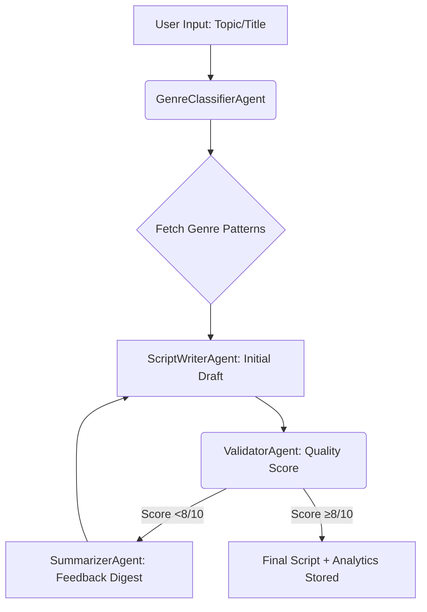

# 🎬 ScriptFlow: Where Creativity Meets Precision in YouTube Scriptwriting


## 🌟 Project Summary
**ScriptFlow** is a revolutionary multi-agent AI system that automates the creation of **high-converting, genre-optimized YouTube scripts** through a data-driven, iterative workflow. By combining specialized AI agents with a rigorous quality control loop, we transform vague ideas into polished scripts tailored to captivate specific audiences.

> 🚀 *"Not just a script generator — a content strategy engine."*

---

## 🔑 Key Features
- **🎭 Genre-Specific Brilliance**  
  Leverages genre patterns (e.g., "Tech Review" hooks, "Comedy Skit" pacing) for context-aware writing.
- **🔁 Infinite Refinement Loop**  
  Scripts iterate through validation and improvement until they hit >8/10 quality scores.
- **📊 Data-Backed Validation**  
  Metrics-driven critique of hooks, CTAs, retention tactics, and value propositions.
- **📚 Pattern Database**  
  Continuously growing library of proven genre templates from historical successes.
- **📦 Plug-and-Play Output**  
  Final scripts saved with metadata for easy integration into YouTube workflows.

---

## 🧠 System Architecture
Four collaborative agents power the magic:

| Agent            | Role                                                                 |
|------------------|----------------------------------------------------------------------|
| **🎭 Classifier** | Maps input topics to genres + fetches pattern databases              |
| **✍️ Writer**     | Crafts drafts using genre patterns + iterative feedback              |
| **✅ Validator**  | Scores scripts on 10+ engagement metrics (fiercely critical!)        |
| **📝 Summarizer** | Translates validator critiques into actionable writing prompts       |

---

## 🔁 Workflow in Action



## Getting Started

Follow these steps to set up and run the project:

### 1. Environment Setup

Create a `.env.local` file in the root directory with the following content:

```
MONGODB_URI=
OPENAI_API_KEY=your_api_key
GOOGLE_API_KEY=your_api_key
```

### 2. API Key Configuration

#### Google API Key
1. Go to [Google AI Studio](https://makersuite.google.com/app/apikey)
2. Click "Get API Key" and create a new API key
3. Copy the generated key and replace `your_api_key` in the `.env.local` file


### 3. Running the Application

To start the development server:

```bash
npm run dev
```


